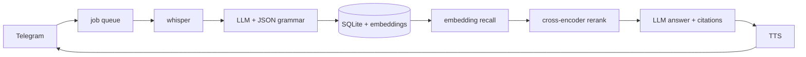

# voicebrain

[](https://github.com/SkanderGhariani/voicebrain/actions/workflows/ci.yml)

Telegram bot that turns voice notes into structured, searchable memory. Everything runs
locally: transcription, extraction, search and text-to-speech. No cloud AI APIs.

Send it a voice note in French, Arabic, English or Italian:

```
you   "Jeudi prochain c'est l'anniversaire de Sarra, il faut que je commande le gâteau avant mercredi."
bot   Note #20 (fr)
      Tasks: order the cake | Dates: next Thursday, Wednesday | People: Sarra

you   /ask quand est l'anniversaire de Sarra ?
bot   L'anniversaire de Sarra est jeudi prochain (#20).  + voice reply
```

## What it does

- Transcribes voice notes locally (faster-whisper), auto language detection
- Extracts summary, tasks, dates, people and topics with a local LLM (llama.cpp + Qwen2.5).
  Output is JSON-schema constrained via grammar, so it always parses
- Stores notes per user in SQLite with sentence embeddings
- `/search`: semantic search over your notes, works across languages
- `/ask`: answers questions from your notes with citations, aware of today's date,
  replies with text and a spoken voice message (Piper TTS)
- `/recent`, `/delete <id>`, `/reset`

## How it works



- `bot.py` handlers and the job queue, `transcribe.py` speech-to-text, `extract.py`
  structured extraction, `storage.py` SQLite, `memory.py` search and RAG, `tts.py` voice replies
- Long polling instead of webhooks: no domain or open ports needed, runs behind NAT
- Notes are processed by a single worker queue. Whisper plus a 7B model per note is heavy;
  serial processing keeps RAM bounded on small hosts
- Search is two-stage: embedding cosine similarity shortlists candidates, a cross-encoder
  reranker scores real relevance and drops the rest. Cosine alone ranks fine but its scores
  are too close together to filter on
- Embeddings are compared brute force with numpy. At this scale a vector database adds
  nothing
- Names from your past notes are passed to whisper as `initial_prompt` so it stops
  mishearing them. Bare names only: a full English sentence there biases the output language
- e5 embeddings need the `query: ` / `passage: ` prefixes they were trained with

## Performance

Measured with `scripts/bench.py` on an i9-14900HX (CPU only, quality profile,
synthetic speech input; real recordings may transcribe a bit slower):

| Step | Warm latency |
|---|---|
| Transcribe an ~11s note | 9 s |
| Extraction (7B) | 11-13 s |
| /search | < 1 s |
| /ask | ~11 s |

First use after startup is slower while models load. The lite profile is not
benchmarked yet.

Two profiles via `.env`:

| | Whisper | LLM | Target |
|---|---|---|---|
| quality | large-v3-turbo | Qwen2.5-7B Q4 | ~10 GB RAM |
| lite | small | Qwen2.5-3B Q4 | 8 GB hosts |

A CUDA GPU can run the stack much faster via llama.cpp's CUDA build.

## Limitations

- One language per voice note. Code-switching mid-note confuses whisper
- A name is only recognized reliably after it has been captured correctly once
- The grammar guarantees valid JSON, not correct content; prompt rules mitigate
- Very short or noisy audio can produce a wrong-language transcript

## Run your own

1. Telegram: talk to @BotFather, `/newbot`, copy the token
2. `cp .env.example .env` and paste the token
3. `python scripts/download_models.py lite` (or `quality`)
4. `docker compose up -d --build`, or without docker:
   `python -m venv .venv`, `pip install -r requirements.txt`, `python bot.py`

The lite profile targets 8 GB hosts.

## Possible improvements

- GPU offload: llama.cpp's CUDA build with `n_gpu_layers` makes generation several
  times faster on any 8 GB GPU
- Task reminders scheduled from the extracted dates
- Hybrid keyword + vector retrieval
- More TTS voices (Arabic, Italian)

## License

MIT
