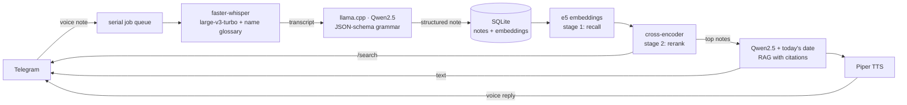

# VoiceBrain 🧠🎙️

[](https://github.com/SkanderGhariani/voicebrain/actions/workflows/ci.yml)

**A self-hosted, multilingual voice assistant with long-term memory, on Telegram.**

Send it a voice note in French, Arabic, English or Italian. It transcribes locally, extracts
the structure (tasks, dates, people, topics), remembers everything, answers questions about
your own life — and talks back. **No cloud AI APIs. Every model runs on your own machine.**

> 🎬 Demo GIF coming here.

```
you   🎤 "Jeudi prochain c'est l'anniversaire de Sarra, il faut que je commande le gâteau avant mercredi."
bot   📝 Note #20 (fr) — Tasks: order the cake · Dates: next Thursday, Wednesday · People: Sarra

you   /ask quand est l'anniversaire de Sarra ?
bot   💡 L'anniversaire de Sarra est jeudi prochain (#20).   🔊 [voice reply]
```

## Features

- 🎙️ **Voice notes in, structure out** — multilingual transcription with automatic language detection
- 🧠 **Guaranteed-valid extraction** — the LLM's JSON output is grammar-constrained: malformed output is impossible by construction
- 🔎 **Semantic memory** — two-stage retrieval (embeddings recall + cross-encoder reranking); search your notes by meaning, in any language
- 💬 **/ask your own life** — RAG over your notes with citations, date-aware ("what do I need to do this week?"), answers in your language
- 🗣️ **It talks back** — answers are also spoken via local neural TTS
- 👤 **Per-user isolation** — every user of the bot has a private memory
- 🪶 **Runs on a €5 CPU server** — no GPU required (lite profile fits 8GB RAM)

## Architecture



**Module map** (deliberately flat — 8 files, each one responsibility):
`bot.py` Telegram handlers + job queue · `transcribe.py` speech-to-text · `extract.py` structured extraction · `storage.py` SQLite persistence · `memory.py` embeddings, two-stage search, RAG · `tts.py` voice replies · `scripts/download_models.py` model fetcher · `tests/` unit tests (no model loads).

## Design decisions

- **Polling, not webhooks.** The bot makes outbound requests only, so it runs behind any NAT — a laptop, a Pi, a VPS — with no domain, SSL, or open ports. Webhooks win at scale; polling wins at sovereignty.
- **Grammar-constrained JSON.** Instead of asking the model nicely and retrying on parse failures, the JSON schema is compiled to a GBNF grammar that masks illegal tokens at each decoding step. Well-formed output is guaranteed; no retry loops. (Lesson learned separately: the grammar guarantees *form*, not *truth* — prompt rules still guard content fidelity.)
- **Two-stage retrieval.** Bi-encoder cosine scores compress into a narrow band (~0.73–0.85 here) — fine for ranking, misleading for relevance cutoffs. A cross-encoder reranker restores real separation (+4 vs −8 on the same data), so irrelevant results are filtered instead of displayed. Benchmarked on real usage before adopting.
- **Brute-force cosine, no vector DB.** At personal-notes scale (thousands), a numpy dot product outruns the operational cost of a vector database. The right tool for 10⁶+ vectors is the wrong tool for 10³.
- **Serial processing queue.** Whisper + a 7B LLM per note; two concurrent notes would double peak RAM on a small host. One worker, bounded resources, queue-position feedback to users.
- **Personalized ASR glossary.** Whisper mangles names it rarely saw ("Walid" → "we did"). Names extracted from a user's past notes are fed back as whisper's `initial_prompt`, so the system learns your people. Hard-won detail: the prompt must be *bare names only* — an English carrier sentence biases whisper's output language and can flip a French note into English.

## Performance (CPU-only, quality profile)

| Step | Latency |
|---|---|
| Transcription (10s voice note) | ~5–10 s |
| Structured extraction (Qwen 7B) | ~10–15 s |
| /search (embed + rerank) | ~1–2 s |
| /ask (retrieve + generate + TTS) | ~40–60 s |

Two profiles, switched entirely via `.env`:
**quality** (≈10GB RAM): whisper `large-v3-turbo` + Qwen2.5-**7B** · **lite** (fits 8GB): whisper `small` + Qwen2.5-**3B**. Same code path. Any 8GB CUDA GPU can run the stack ~10x faster via llama.cpp's CUDA build.

## Known limitations

- **One language per voice note** — Whisper picks a single language; code-switching mid-note produces mangled output.
- **Glossary cold start** — a name is only protected after it has been correctly captured once.
- **Small-model content slips** — grammar guarantees valid JSON, not correct facts; prompt rules mitigate (e.g. date fidelity), larger models reduce further.
- **Whisper hallucinates on noise** — very short/mumbled audio can produce a random-language transcript.

## Deploy your own

1. **Create a bot:** Telegram → @BotFather → `/newbot` → copy the token.
2. **Configure:** `cp .env.example .env`, paste the token, pick a profile.
3. **Models:** `python scripts/download_models.py lite` (or `quality`).
4. **Run:**
   - Docker (recommended on a server): `docker compose up -d --build`
   - Bare: `python -m venv .venv && pip install -r requirements.txt && python bot.py`

Runs comfortably on an 8GB VPS (~€5–9/month) with the lite profile.

## Future work

Task reminders scheduled from extracted dates · hybrid keyword+vector retrieval · streaming responses · more TTS voices (Arabic, Italian).

## License

MIT
